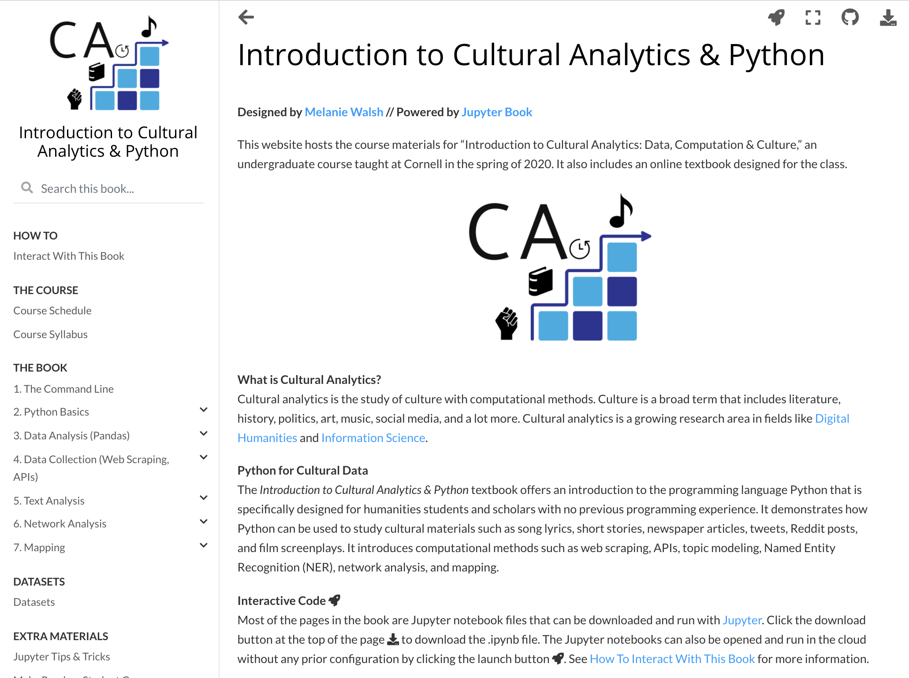

# Introduction to Cultural Analytics & Python

Designed by [Melanie Walsh](https://melaniewalsh.org/) // Powered by [Jupyter Book](https://jupyterbook.org/)

This repository hosts the course materials for "Introduction to Cultural Analytics: Data, Computation & Culture," an undergraduate course taught at Cornell in the spring of 2020 and 2021. It includes an online textbook designed for the class, *Introduction to Cultural Analytics & Python*, which demonstrates how Python can be used to study cultural materials such as song lyrics, short stories, newspaper articles, tweets, Reddit posts, and film screenplays. 

[](https://melaniewalsh.github.io/Intro-Cultural-Analytics/)

Course website and textbook: https://melaniewalsh.github.io/Intro-Cultural-Analytics/

# Jupyter Book Overview and Repository Structure

The Python package [`jupyter-book`](https://jupyterbook.org/intro.html#install-jupyter-book) processes the Jupyter notebook files from this repository and outputs them as the publication-quality HTML files that generate the [corresponding website](https://melaniewalsh.github.io/Intro-Cultural-Analytics/).

The HTML files are currently hidden in this branch of the GitHub repository, but you can find them in the [gh-pages branch](https://github.com/melaniewalsh/Intro-Cultural-Analytics/tree/gh-pages).

Below I will briefly explain the structure of this repository and some important Jupyter Book features.

-  [`/book`](https://github.com/melaniewalsh/Intro-Cultural-Analytics/tree/master/book) contains all the materials that generate the Jupyter Book
- [`/binder`](https://github.com/melaniewalsh/Intro-Cultural-Analytics/tree/master/binder) contains materials that set up the virtual [Binder](https://mybinder.org/) environment for running Jupyter notebooks in the cloud 

### Configuration file

The configuration file [`/book/_config.yml`](https://github.com/melaniewalsh/Intro-Cultural-Analytics/blob/master/book/_config.yml) is where I establish key features of the book, such as the title, logo, and whether users can open the Jupyter notebook files in the cloud.
 
### Table of Contents file

The table of contents file [`/book/_toc.yml`](https://github.com/melaniewalsh/Intro-Cultural-Analytics/blob/master/book/_toc.yml) establishes the table of contents structure on the left-hand side of the web page.

To include a Markdown or Jupyter notebook file in the table of contents, you include the flag `- file:` followed by the file path *without* the file extension, as shown below: 
```
- file: welcome

- part: How To
  chapters:
  - file: How-To-Interact-With-This-Book
    title: Interact With This Book

- part: The Course
  chapters:
  - file: course-schedule
    title: Course Schedule

  - file: syllabus
    title: Course Syllabus
  
- part: The Book
  chapters:
  - file: Command-Line/The-Command-Line

  - file: Python/Python
    sections:
      - file: Python/Installation
      - file: Python/How-to-Use-Jupyter-Notebooks
```

If you want the title in the table of contents to be different from the title in the notebook, you can also specify a different `title` below the `- file:` flag. Finally, you can include section headers within the table of contents by using the `- part` flag or designate nested chapters by including `chapters:`.

### Notebooks

The Jupyter notebook files can be found in directories named for chapters:
- [`/book/Command-Line`](https://github.com/melaniewalsh/Intro-Cultural-Analytics/tree/master/book/Command-Line)
-  [`/book/Python`](https://github.com/melaniewalsh/Intro-Cultural-Analytics/tree/master/book/Python)
-  [`/book/Data-Analysis`](https://github.com/melaniewalsh/Intro-Cultural-Analytics/tree/master/book/Data-Analysis)
-  [`/book/Data-Collection`](https://github.com/melaniewalsh/Intro-Cultural-Analytics/tree/master/book/Data-Collection)
-  [`/book/Text-Analysis`](https://github.com/melaniewalsh/Intro-Cultural-Analytics/tree/master/book/Text-Analysis)
-  [`/book/Network-Analysis`](https://github.com/melaniewalsh/Intro-Cultural-Analytics/tree/master/book/Network-Analysis)
-  [`/book/Mapping`](https://github.com/melaniewalsh/Intro-Cultural-Analytics/tree/master/book/Mapping)

### Data

Data can be can be found in [`/book/data`](https://github.com/melaniewalsh/Intro-Cultural-Analytics/tree/master/book/data)

### Texts

Texts can be can be found in [`/book/texts`](https://github.com/melaniewalsh/Intro-Cultural-Analytics/tree/master/book/texts)

### Custom CSS

Custom CSS styling can be found in [`/book/_static/custom.css`](https://github.com/melaniewalsh/Intro-Cultural-Analytics/blob/master/book/_static/custom.css) (it's a bit messy at the moment, sorry)


# How to Build and Publish Jupyter Book with GitHub Pages

- Run `jupyter-book build /book` or `jb build /book`, where `/book` is the directory with your Jupyter notebook files

A fully-rendered HTML version of the book will be built in `/book/_build/html/`. You can push these HTML files to a GitHub pages website by pushing them to the `gh-pages` branch of a GitHub repository.
 
One easy way to push to the `gh-pages` branch is to [install `gh-import`](https://jupyterbook.org/publish/gh-pages.html#push-your-book-to-a-branch-hosted-by-github-pages).

- Run `ghp-import -n -p -f book/_build/html`


# Learn More About Jupyter Book

You can learn more about Jupyter Book by exploring the documentation: https://jupyterbook.org/intro.html

# Acknowledgments
This course was inspired by a range of excellent course materials, including those by [Lauren Klein](https://github.com/laurenfklein/emory-qtm340), [David Mimno](https://mimno.infosci.cornell.edu/info3350/), and [Allison Parrish](https://github.com/aparrish/rwet).

# License

This book is licensed under a [Creative Commons Attribution-NonCommercial-ShareAlike 4.0 International (CC BY-NC-SA 4.0) License](https://creativecommons.org/licenses/by-nc-sa/4.0/). The code is licensed under a [GNU General Public License v3.0](https://choosealicense.com/licenses/gpl-3.0/#).